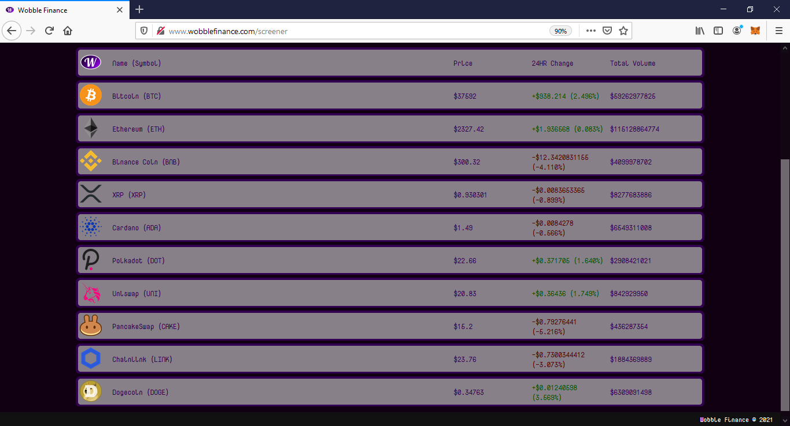

# WobbleFinance

**Wobble Finance Website:**    
http://www.wobblefinance.com

During this past semester I took the time to independently study cryptocurrencies, blockchain technology, and decentralized finance. From what I learned I was inspired to not only invest in various tokens, but to also create a token of my own! Earlier this month I released Wobble Finance, an entry-level cryptocurrency screener web app, along with a complimentary miniseries. In addition to this I was able to deploy the Wobble Finance Token (WBBL) to the Binance Smart Chain main net where anyone from around the globe can buy, sell, or contribute to the token's liquidity pool.   

Wobble Finance is a bare-bones cryptocurrency screener that allows the user to look up hundreds of different cryptocurrencies and see how they are performing. Simply search for any major cryptocurrency symbol and in seconds get the bread-and-butter statistics about it, including the current price, the 24-hour price change, and the total exchange volume in USD.

Wobble Finance was created to help those new to the cryptocurrency space learn more about cryptocurrencies through educational videos and then apply what they have learned with the aid of the Wobble Finance screener web app. In addition to this there is the Wobble Finance Token (WBBL) that helps fund API calls for the web app. The Wobble Finance Token (WBBL) is available to trade on the Binance Smart Chain as a BEP-20 token and is a listed asset on PancakeSwap.

